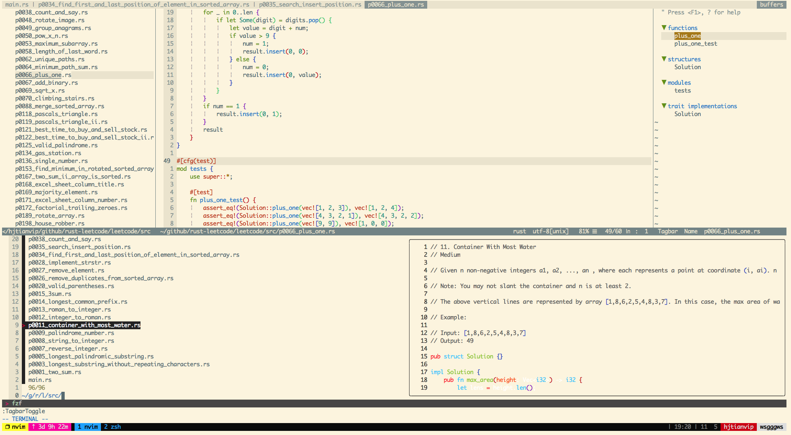

# My-Neovim-Configurations
使用Neovim来写Python, Rust, Golang, MarkDown, ...

## Version
- MacOS: 10.13.6
- Iterm2: 3.3.9
- Neovim: NVIM v0.5.0-nightly

## Preview


## Install Neovim
See [Neovim Install](https://github.com/neovim/neovim/wiki/Installing-Neovim)
```
brew install --HEAD neovim
pip3 install neovim --upgrade
ln -s ~/.vim ~/.config/nvim
ln -s ~/.vimrc ~/.config/nvim/init.vim
alias vim='nvim'
alias vi='nvim'
```

## Install dependence software and python3 packages
#### Python3.6.8
- [python3.6+](https://www.python.org/ftp/python/3.6.8/python-3.6.8-macosx10.9.pkg)

#### Git
- `brew install git`

#### NodeJS and Yarn
- `brew install nodejs`
- `brew install yarn`

#### Flake8 and Pylint
- `pip3 install flake8 pylint`

#### autopepe8 and black and yapf
- `pip3 install autopepe8 isort black yapf`

## Install plugs
#### Install vim-plug
- curl -fLo ~/.vim/autoload/plug.vim --create-dirs \
    https://raw.githubusercontent.com/junegunn/vim-plug/master/plug.vim

#### Ready .vimrc
- cp [vimrc](./vimrc) ~/.vimrc

#### Install plugs
- nvim ~/.vimrc 
- :PlugInstall
- :CocInstall coc-python
- :CocInstall coc-rls

## QA
##### MacOS Neovim Command+v粘贴复制好的中文出现乱码
- Item2 perference -> profiles -> Terminal -> Character encoding(UTF-8)
- Zsh(这需要非常注意,否则Command+V粘贴复制好的中文(使用p/P命令不会)会乱码)
    - export LC_ALL=en_US.UTF-8
    - export LANG=en_US.UTF-8
- vimrc
    - set fileencodings=utf-8,ucs-bom,gb18030,gbk,gb2312,cp936
    - set termencoding=utf-8
    - set encoding=utf-8

##### 多个Python环境时，如何指定Coc的Python环境
```
Run :CocCommand python.setInterpreter to get current python, it could be not your current python in $PATH.
```
